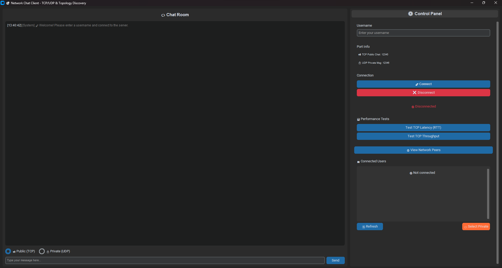

# 🌐 Network Chat Application Project

[](https://www.python.org/)
[](LICENSE)

A multi-user network chat application with a rich user interface, featuring public chat over TCP, reliable private messaging over UDP, and network topology discovery.

## 🖼️ Screenshots



## 🚀 About This Project

This project is a comprehensive chat application developed for a Networking course. It implements all the core components of the course requirements, including a custom communication protocol, public chat over TCP, reliable private messaging over UDP, and a network topology discovery service. The application features a modern and responsive graphical user interface.

## ✨ Key Features

- 💬 **Dual Protocol Communication**: Uses TCP for the reliability of public chat and UDP for the low latency of private messages and user discovery.
- 🎨 **Modern UI**: An intuitive and aesthetically pleasing interface built with `customtkinter`.
- 🗺️ **Network Topology Discovery**: Automatically discovers other users on the local network and displays them, along with Round-Trip Time (RTT) measurements.
- 🛡️ **Reliable UDP**: A custom reliability layer built on top of UDP with sequence numbers and acknowledgment mechanisms to prevent message loss and out-of-order delivery.
- 📊 **Performance Testing**: Includes built-in tools to measure TCP latency (RTT) and throughput directly from the user interface.

## 🛠️ Tech Stack

- [Python](https://www.python.org/)
- [CustomTkinter](https://github.com/TomSchimansky/CustomTkinter)
- Socket Programming (TCP/IP & UDP)

## 📂 Project Structure

```
network-chat/
│
├── 📜 start_server.py       # Main script to launch the server (TCP & UDP)
├── 🖥️ server.py             # Server logic, client management, and message routing
├── 🎨 chat_gui.py           # Client-side graphical user interface
├── 📦 protocol.py           # Custom protocol definitions for client-server communication
├── 📡 topology_discovery.py # Logic for discovering other clients and measuring RTT
├── 📄 requirements.txt      # Required Python libraries
└── 📖 README.md             # This file
```

## ⚙️ Installation and Setup

Follow these steps to set up and run the application on your local machine.

1.  **Clone (or Download) the Project:**
    ```sh
    git clone https://your-repository-link.git
    cd network-chat
    ```
    Or download the `.zip` file and extract it to a folder.

2.  **Create a Virtual Environment (Recommended):**
    Open a terminal in the project folder and run the following commands:
    ```bash
    # Create the virtual environment
    python -m venv venv

    # Activate the environment
    # On Windows:
    .\venv\Scripts\activate
    # On macOS/Linux:
    source venv/bin/activate
    ```

3.  **Install Dependencies:**
    With the virtual environment active, install the required libraries:
    ```bash
    pip install -r requirements.txt
    ```

4.  **Run the Application:**

    This application requires a server to be running before clients can connect.

    **A. Start the Server:**
    - In your terminal, navigate to the project directory and run the `start_server.py` script.
    ```sh
    python start_server.py
    ```
    - The server will keep running in this terminal window.

    **B. Start the Client(s):**
    - Open a **new terminal** for each client you want to run.
    - Navigate to the project directory and run the `chat_gui.py` file.
    ```sh
    python chat_gui.py
    ```
    - The application window will open. You can launch multiple clients this way.

## 📖 Usage
1.  In each client window, enter a **unique username** in the "Username" field.
2.  Click the **"🚀 Connect"** button.
    - This will connect the client to the dedicated server.
3.  You can now chat in the public room or select a user from the list for private messaging.

## 👥 Team Members

- Mehmet Emre Kayacan
- Oğuz Genç
- Muhammed Enes Çetinkaya

## 📄 License

This project is distributed under the MIT License. See the `LICENSE` file for more information. 